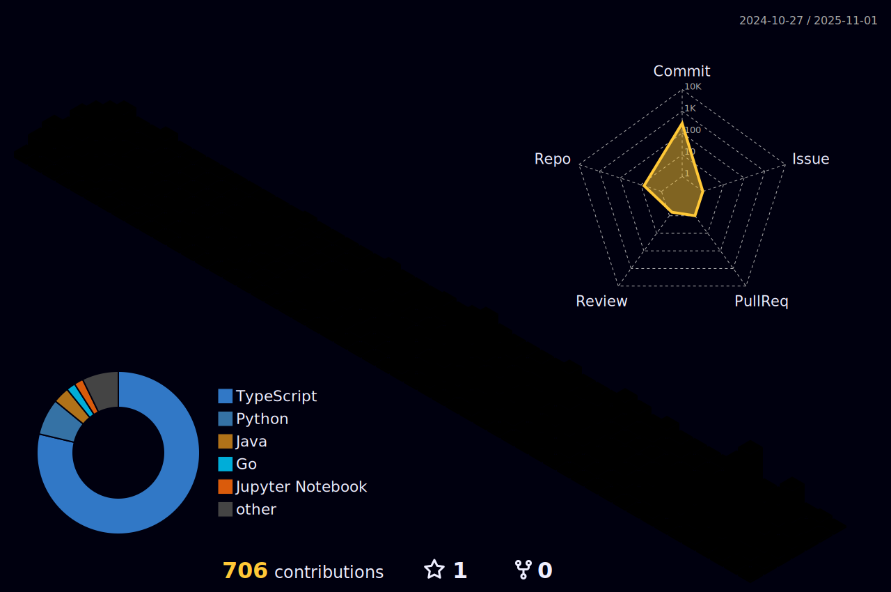

<!--horizontal divider(gradiant)-->

<h1 align="center"><b>Hi, I'm Lucas Firmino</b> </h1>

  

##  **About me**

- 🎓 23 years old computer science student at at the Federal Center for Technological Education of Rio de Janeiro (CEFET/RJ), expecting to graduate in July 2025.
- 💼 Full StackDeveloper at Procuradoria Geral do Município do Rio de Janeiro

##  **GitHub Stats**

## <b> Tech Stack</b>

  
- **Languages**:
  
  
  
  
  
  
  

    

- **Frameworks & Bibliotecas**:
  
  
  
  
  
  

 

- **Banco de Dados**:
  
  
  
  
  
  

 

- **DevOps & Ferramentas**:
    
  
  
  
  
  

 

- **Extras**:
  
  
  
  
  
  

 

##  **Job Experience**
 

<table border="0" cellspacing="0" cellpadding="0">
  <tr>
    <td width="100px">
      
    </td>
    <td>
      <b>System Analyst Intern</b> • <i>Jan 2024 – Present</i>  
      <b>Procuradoria Geral do Município do Rio de Janeiro</b>  
      <b>Technologies:</b> <code>Python</code> <code>TypeScript</code> <code>JavaScript</code> <code>Delphi</code>
    </td>
  </tr>
</table>

 

##  **GitHub Trophies**
 

 

Contact me at my [LinkedIn](https://www.linkedin.com/in/lucasfirminobatista/) for more details about my job experience, education and certificates.

<!--horizontal divider(gradiant)-->

